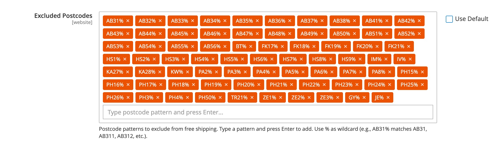

# Magento 2 Stores Configuration Elements Fields

A Magento 2 module that provides enhanced UI elements for the Stores > Configuration section, including a user-friendly cron expression editor field.

## Features
- **Cron Expression Editor**: Interactive, validated, and human-readable cron field for system configuration.
- **Catalog Category Selector**: A custom field type for selecting categories in the system configuration.
- **Tag List Input**: Tag-style input for managing lists of values (postcodes, SKUs, keywords, etc.).
- **CodeMirror Editor**: Syntax-highlighted code editor supporting multiple languages (CSS, JavaScript, HTML, PHP, SQL, YAML, etc.).
- Modern UI/UX with real-time validation and summary.

## Installation
### Via Composer

```bash
composer require hryvinskyi/magento2-configuration-fields
bin/magento module:enable Hryvinskyi_ConfigurationFields
bin/magento setup:upgrade
```

### Manual Installation
1. Copy the module to `app/code/Hryvinskyi/ConfigurationFields`.
2. Run the following Magento CLI commands:
   ```bash
   bin/magento setup:upgrade
   bin/magento setup:di:compile
   bin/magento cache:flush
   ```
   
## How It Works
- The module adds a new system configuration field type that renders a cron editor UI.
- The editor provides validation, error highlighting, and a summary of the cron schedule.
- The value is stored as a standard cron expression string.

## Example system.xml Usage

```XML
<field id="expression" translate="label" type="text" sortOrder="10" showInDefault="1" showInWebsite="1" showInStore="1">
    <label>Cron Expression</label>
    <frontend_model>Hryvinskyi\ConfigurationFields\Block\Adminhtml\System\Config\Form\Field\CronEditor</frontend_model>
</field>

<field id="category" translate="label" type="multiselect" sortOrder="20" showInDefault="1" showInWebsite="1" showInStore="1">
   <label>Categories Multiselect</label>
   <frontend_model>Hryvinskyi\ConfigurationFields\Block\Adminhtml\System\Config\Form\Field\UiSelect</frontend_model>
</field>

<field id="category" translate="label" type="select" sortOrder="20" showInDefault="1" showInWebsite="1" showInStore="1">
   <label>Categories Select</label>
   <frontend_model>Hryvinskyi\ConfigurationFields\Block\Adminhtml\System\Config\Form\Field\UiSelect</frontend_model>
</field>

<!-- Tag List Input - for managing lists of values like postcodes, SKUs, keywords -->
<field id="tag_list" translate="label comment" type="text" sortOrder="30" showInDefault="1" showInWebsite="1" showInStore="0">
    <label>Tag list</label>
    <comment>Type a value and press Enter to add. Use % as wildcard.</comment>
    <frontend_model>Hryvinskyi\ConfigurationFields\Block\Adminhtml\System\Config\Form\Field\TagList</frontend_model>
</field>

<!-- CodeMirror Editors - syntax-highlighted code editors -->
<field id="custom_css" translate="label" type="textarea" sortOrder="40" showInDefault="1" showInWebsite="1" showInStore="1">
    <label>Custom CSS</label>
    <frontend_model>Hryvinskyi\ConfigurationFields\Block\Adminhtml\System\Config\Form\Field\CodeMirror\CssEditor</frontend_model>
</field>

<field id="custom_js" translate="label" type="textarea" sortOrder="50" showInDefault="1" showInWebsite="1" showInStore="1">
    <label>Custom JavaScript</label>
    <frontend_model>Hryvinskyi\ConfigurationFields\Block\Adminhtml\System\Config\Form\Field\CodeMirror\JavascriptEditor</frontend_model>
</field>
```

### Tag List Configuration via DI

For custom TagList configuration, create virtual types in your module's `di.xml`:

**Step 1: Create virtual types in di.xml**

```xml
<!-- Frontend model with custom configuration -->
<virtualType name="MyModule\Block\Adminhtml\MyTagList"
             type="Hryvinskyi\ConfigurationFields\Block\Adminhtml\System\Config\Form\Field\TagList">
    <arguments>
        <argument name="tagListConfig" xsi:type="array">
            <item name="placeholder" xsi:type="string">Enter value and press Enter...</item>
            <item name="validation" xsi:type="string">^[A-Za-z0-9%]+$</item>
            <item name="uppercase" xsi:type="boolean">true</item>
            <item name="separator" xsi:type="string">\n</item>
        </argument>
    </arguments>
</virtualType>

<!-- Backend model with matching configuration -->
<virtualType name="MyModule\Model\Config\Backend\MyTagList"
             type="Hryvinskyi\ConfigurationFields\Model\Config\Backend\TagList">
    <arguments>
        <argument name="tagListConfig" xsi:type="array">
            <item name="separator" xsi:type="string">\n</item>
        </argument>
    </arguments>
</virtualType>
```

**Step 2: Reference in system.xml**

```xml
<field id="my_tags" translate="label" type="text" sortOrder="10" showInDefault="1">
    <label>My Tags</label>
    <frontend_model>MyModule\Block\Adminhtml\MyTagList</frontend_model>
    <backend_model>MyModule\Model\Config\Backend\MyTagList</backend_model>
</field>
```

### Configuration Options

| Option | Type | Default | Description |
|--------|------|---------|-------------|
| `placeholder` | string | "Type value and press Enter..." | Input placeholder text |
| `validation` | string | `^[A-Za-z0-9]+$` | Regex pattern for validation |
| `uppercase` | boolean | true | Auto-uppercase input values |
| `separator` | string | `\n` | Separator for values (`\n`, `\t`, `,`, etc.) |
| `save_type` | string | separator | Storage format: `json`, `serialized`, or `separator` |

### Storage Formats

| Save Type | Description | Storage Example |
|-----------|-------------|-----------------|
| `separator` | Values separated by a character (default) | `VALUE1\nVALUE2\nVALUE3` |
| `json` | JSON array format | `["VALUE1","VALUE2","VALUE3"]` |
| `serialized` | PHP serialized format | `a:3:{i:0;s:6:"VALUE1";...}` |

### Complete Example

**di.xml:**
```xml
<!-- Excluded TagList -->
<virtualType name="MyModule\Block\Adminhtml\TagList"
             type="Hryvinskyi\ConfigurationFields\Block\Adminhtml\System\Config\Form\Field\TagList">
    <arguments>
        <argument name="tagListConfig" xsi:type="array">
            <item name="placeholder" xsi:type="string">Enter pattern...</item>
            <item name="validation" xsi:type="string">^[A-Za-z0-9%]+$</item>
            <item name="uppercase" xsi:type="boolean">true</item>
            <item name="separator" xsi:type="string">\n</item>
            <item name="save_type" xsi:type="string">separator</item>
        </argument>
    </arguments>
</virtualType>

<virtualType name="MyModule\Model\Config\Backend\TagList"
             type="Hryvinskyi\ConfigurationFields\Model\Config\Backend\TagList">
    <arguments>
        <argument name="tagListConfig" xsi:type="array">
            <item name="separator" xsi:type="string">\n</item>
            <item name="save_type" xsi:type="string">separator</item>
        </argument>
    </arguments>
</virtualType>
```

**system.xml:**
```xml
<field id="tag_list" translate="label comment" type="text" sortOrder="30" showInDefault="1">
    <label>Tag List</label>
    <comment>Tag list comment</comment>
    <frontend_model>MyModule\Block\Adminhtml\TagList</frontend_model>
    <backend_model>MyModule\Model\Config\Backend\TagList</backend_model>
</field>
```

### CodeMirror Editor Classes

The module provides pre-built CodeMirror editor classes for common languages in the `CodeMirror` namespace. Use them directly in your `system.xml`:

**Namespace:** `Hryvinskyi\ConfigurationFields\Block\Adminhtml\System\Config\Form\Field\CodeMirror\`

**Available Editor Classes:**

| Class | Language | Mode |
|-------|----------|------|
| `CssEditor` | CSS | `css` |
| `LessEditor` | LESS | `text/x-less` |
| `ScssEditor` | SCSS | `text/x-scss` |
| `JavascriptEditor` | JavaScript | `javascript` |
| `JsonEditor` | JSON | `application/json` |
| `HtmlEditor` | HTML (mixed) | `htmlmixed` |
| `XmlEditor` | XML | `xml` |
| `PhpEditor` | PHP | `php` |
| `SqlEditor` | SQL | `sql` |
| `YamlEditor` | YAML | `yaml` |
| `MarkdownEditor` | Markdown | `markdown` |
| `ShellEditor` | Shell/Bash | `shell` |

**Usage in system.xml:**

```xml
<!-- CSS Editor -->
<field id="custom_css" translate="label" type="textarea" sortOrder="10" showInDefault="1">
    <label>Custom CSS</label>
    <frontend_model>Hryvinskyi\ConfigurationFields\Block\Adminhtml\System\Config\Form\Field\CodeMirror\CssEditor</frontend_model>
</field>

<!-- JavaScript Editor -->
<field id="custom_js" translate="label" type="textarea" sortOrder="20" showInDefault="1">
    <label>Custom JavaScript</label>
    <frontend_model>Hryvinskyi\ConfigurationFields\Block\Adminhtml\System\Config\Form\Field\CodeMirror\JavascriptEditor</frontend_model>
</field>

<!-- JSON Editor -->
<field id="json_config" translate="label" type="textarea" sortOrder="30" showInDefault="1">
    <label>JSON Configuration</label>
    <frontend_model>Hryvinskyi\ConfigurationFields\Block\Adminhtml\System\Config\Form\Field\CodeMirror\JsonEditor</frontend_model>
</field>

<!-- HTML Editor -->
<field id="custom_html" translate="label" type="textarea" sortOrder="40" showInDefault="1">
    <label>Custom HTML</label>
    <frontend_model>Hryvinskyi\ConfigurationFields\Block\Adminhtml\System\Config\Form\Field\CodeMirror\HtmlEditor</frontend_model>
</field>
```

### Custom CodeMirror Configuration via DI

For custom configuration (theme, options), create virtual types in your module's `di.xml`:

```xml
<!-- Custom CSS Editor with Monokai theme -->
<virtualType name="MyModule\Block\Adminhtml\DarkCssEditor"
             type="Hryvinskyi\ConfigurationFields\Block\Adminhtml\System\Config\Form\Field\CodeMirror\CssEditor">
    <arguments>
        <argument name="editorConfig" xsi:type="array">
            <item name="theme" xsi:type="string">monokai</item>
            <item name="line_numbers" xsi:type="boolean">true</item>
            <item name="line_wrapping" xsi:type="boolean">false</item>
        </argument>
    </arguments>
</virtualType>
```

**Configuration Options:**

| Option           | Type    | Default     | Description                |
|------------------|---------|-------------|----------------------------|
| `mode`           | string  | (per class) | Syntax highlighting mode   |
| `theme`          | string  | `default`   | Editor color theme         |
| `line_numbers`   | boolean | `true`      | Show line numbers          |
| `line_wrapping`  | boolean | `true`      | Wrap long lines            |

**Available Themes:**
- `default` - Light theme (default)
- `monokai` - Dark theme with vibrant colors
- `material` - Material Design inspired
- `dracula` - Dark purple theme

### CodeMirror UI Component Usage

For UI component forms (admin forms, not system configuration), use the CodeMirror form element.

**In your UI component XML:**

```xml
<field name="custom_code" formElement="textarea">
    <argument name="data" xsi:type="array">
        <item name="config" xsi:type="array">
            <item name="component" xsi:type="string">Hryvinskyi_ConfigurationFields/js/form/element/codemirror</item>
            <item name="template" xsi:type="string">ui/form/field</item>
            <item name="editorConfig" xsi:type="array">
                <item name="mode" xsi:type="string">css</item>
                <item name="theme" xsi:type="string">default</item>
                <item name="lineNumbers" xsi:type="boolean">true</item>
                <item name="lineWrapping" xsi:type="boolean">true</item>
            </item>
        </item>
    </argument>
    <settings>
        <label translate="true">Custom Code</label>
        <dataType>text</dataType>
    </settings>
</field>
```

## Screenshots




## Support

For issues, questions or contributions, please contact the author or create an issue in the GitHub repository.

## Author

- **Volodymyr Hryvinskyi**
- Email: volodymyr@hryvinskyi.com
- GitHub: https://github.com/hryvinskyi

## License

This project is licensed under the MIT License.
